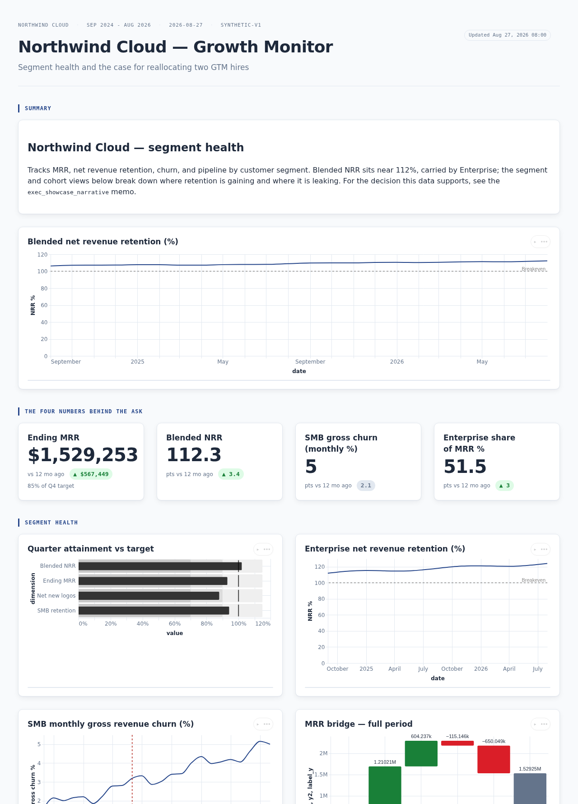
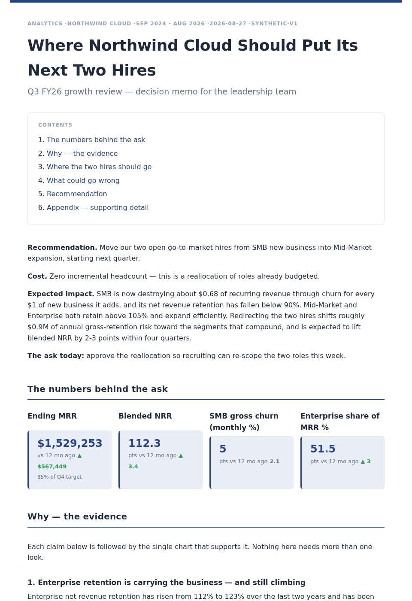

# asql

**Write SQL. Get a dashboard.**

`asql` turns a `.sql` file with a few `-- @` comments into a polished, self-contained
HTML analytics report. You write the query. `asql` picks the right chart, lays out the
page, and renders it — no BI tool, no notebook, no JavaScript, no `<div>` wrangling.



The entire source for a report like this is a plain `.sql` file you can run through
DuckDB, diff in a PR, and hand to the next analyst.

---

## Install

```bash
curl -fsSL https://cuiqanalytics.github.io/asql/install.sh | sh
```

No root needed — unpacks to `~/.local/lib/asql` and links `asql` onto your `PATH` at
`~/.local/bin/asql`. Re-running it later just replaces the previous install (upgrade in
place).

Prefer to do it by hand, or on a machine without a `~/.local/bin`-on-PATH setup?

```bash
curl -fsSL https://github.com/cuiqanalytics/asql/releases/latest/download/asql-cli-linux-x86_64.tar.gz | tar xz
cd asql-cli-linux-x86_64
./asql --version
```

`./asql` is a tiny launcher that points asql at the bundled DuckDB library next to it,
then hands off to `bin/asql`. **Use the launcher, not `bin/asql` directly**, and keep
`bin/` intact — the binary needs `bin/libduckdb.so` to run. Put it on your `PATH`
yourself in this path: `ln -s "$PWD/asql" ~/.local/bin/asql`.

Prefer a container? See **Docker**, next.

---

## Docker

No binary to unpack — pull the image and run it:

```bash
docker pull ghcr.io/cuiqanalytics/asql
```

Every `asql` subcommand works the same way: mount the directory holding your `.sql` file
(and any CSVs it reads) to `/work`, then run the command as if it came after `asql`.

```bash
docker run --rm -v "$PWD:/work" ghcr.io/cuiqanalytics/asql build revenue.sql
docker run --rm -v "$PWD:/work" ghcr.io/cuiqanalytics/asql query revenue.sql --format csv
docker run --rm -v "$PWD:/work" ghcr.io/cuiqanalytics/asql build --theme themes/nordic.css revenue.sql
```

`preview`'s live-reload server binds to `localhost` inside the container, so it isn't
reachable through a published port (`-p`) — use a native install for `preview`, Docker
for everything else.

A shell function saves retyping the mount every time:

```bash
asql() { docker run --rm -v "$PWD:/work" ghcr.io/cuiqanalytics/asql "$@"; }
asql build revenue.sql
```

---

## Claude Code skills

Two skills teach Claude Code to write asql reports for you — the `-- @` syntax, the chart
intents, and (for `asql-exec`) how to structure a report that lands with a decision-maker.
`install.sh`/the release tarball both include `install-skills.sh` at the top level of
what they install:

```bash
~/.local/lib/asql/install-skills.sh          # if you used install.sh
./install-skills.sh                          # if you unpacked the tarball by hand
./install-skills.sh /custom/path            # → /custom/path/<skill>
./install-skills.sh --uninstall
```

An existing copy of each skill is backed up before it's replaced. Restart Claude Code
afterward. Then: *"build me a dashboard from sales.csv showing revenue by month"*.

---

## What's in the download

`install.sh` and the release tarball both unpack the same payload (Docker's image only
carries `bin/` — everything else here is reference material you're presumably already
reading from this site):

```
asql                  ← run this
bin/asql              the binary
bin/libduckdb.so      DuckDB v1.4.4
bin/DUCKDB_VERSION    the exact DuckDB build this bundle was tested against
install-skills.sh     install the Claude Code skills
TUTORIAL.md           QUICK_REFERENCE.md
examples/             ready-to-build .sql reports
themes/               drop-in CSS themes
skills/               asql + asql-exec skills for Claude Code
```

---

## Quickstart (60 seconds)

**Write `revenue.sql`:**

```sql
-- @report
-- title: Revenue Dashboard
-- subtitle: 2026

-- @chart: trend
-- title: Monthly Revenue by Channel

SELECT
    date_trunc('month', order_date) AS date,
    acquisition_channel             AS series,
    sum(revenue)                    AS value
FROM read_csv_auto('orders.csv')
GROUP BY 1, 2
ORDER BY 1;

-- @chart: ranking
-- title: Top Cities

SELECT city AS dimension, sum(revenue) AS value
FROM read_csv_auto('orders.csv')
GROUP BY 1 ORDER BY 2 DESC LIMIT 10;

-- @chart: kpi
-- title: Total Revenue

SELECT sum(revenue) AS value FROM read_csv_auto('orders.csv');
```

**Build it:**

```bash
./asql build revenue.sql
```

That writes `revenue.html` next to the source — a multi-series line chart, a horizontal
bar chart, and a KPI card. Open it in a browser. You never specified a chart type.

---

## The whole idea: `-- @` blocks

A report is a sequence of blocks. Each starts at a `-- @<type>` line and runs to the
next one.

| Block | What it is |
|---|---|
| `-- @report` | Title, subtitle, layout, page chrome — no SQL |
| `-- @chart: <intent>` | Metadata lines, then **one** SQL statement |
| `-- @narrative` | A `{{ column }}`-templated sentence backed by a query |
| `-- @markdown` | Static prose |
| `-- @setup` | Shared views/CTEs, run once before the blocks that need them |
| `-- @section: <name>` | Splits the report into independently laid-out sections |

### Chart intents

Name the *question*, not the chart:

| Intent | Answers | Renders as |
|---|---|---|
| `trend` / `area` | A measure over time | Line / area, series auto-folded past the top 8 |
| `comparison` | How categories compare in size | Vertical or horizontal bars, sorted |
| `ranking` | What's the order — who's #1? | Horizontal bars in your `ORDER BY` |
| `deviation` | Signed variance vs a reference | Diverging bars around zero, green/red |
| `bullet` | Actual vs target vs qualitative bands | Bullet graph |
| `distribution` / `boxplot` | Spread of a number (overall / by group) | Histogram / box plot |
| `composition` | Parts of a whole | Pie, 100% stacked bar, or stacked area |
| `relationship` / `bubble` | Two (or three, sized) numbers correlated | Scatter |
| `sparkline` | The shape of a series at a glance | Tiny axis-less line |
| `heatmap` | A measure across two dimensions | Colour grid |
| `funnel` | Stage-by-stage drop-off | % bars |
| `waterfall` | Cumulative build-up / breakdown | Floating bars |
| `flow` | Volume moving between stages/entities | Sankey diagram (dashboard only) |
| `slopegraph` / `bump` | Before/after level & rank change | Slope / rank lines |
| `kpi` | One headline number | Big number, tile row, or table |
| `auto` | Let asql decide | Picks from the result shape |

Full syntax, overrides (`-- x:`, `-- series:`, `-- target:`, reference lines, CI bands,
callouts, deltas…) and layouts: **[TUTORIAL.md](TUTORIAL.md)** and
**[QUICK_REFERENCE.md](QUICK_REFERENCE.md)**.

---

## Live preview while you edit

```bash
./asql preview revenue.sql          # → http://localhost:4321
```

Every save rebuilds and reloads the open tab. A broken query shows the error instead of
crashing, and recovers on your next save. Each card has an inline **✎ Edit** to change
its chart type, SQL, or metadata in the browser and write it back to the `.sql` file.

---

## Narrative reports

Add `-- format: narrative` under `-- @report` and the same file builds as a print-ready
document instead — a single reading column, static inline charts, a table of contents,
`{{ column }}`-templated sentences that pull real numbers from your queries.



---

## Also useful

```bash
./asql query revenue.sql              # run a flat .sql file, print the rows
./asql query --format csv revenue.sql # …as CSV
./asql build --theme themes/midnight.css revenue.sql   # restyle via CSS variables
./asql build --fresh revenue.sql      # ignore the query cache
```

- **Themes** — a small `:root` CSS file overrides colours, fonts, chart palette. Five
  ship in `themes/`.
- **Interactive filters** — `-- filter: region` renders a sticky dropdown that
  re-filters every chart client-side; the selection is a shareable URL. `-- slider:` is the
  same idea as a discrete slider instead of a dropdown, `-- slider-range:` a min/max range
  slider.
- **Query cache** — repeat builds skip unchanged queries.
- **KaTeX** — `$…$` in narrative/markdown prose renders as math.

---

## Examples

Four reports in **[`examples/`](examples/)**, all on one shared synthetic dataset
(regenerated by `examples/northwind.sql`) — except `experiment_readout.sql`, which is
self-contained:

```bash
./asql build examples/growth_dashboard.sql    # the broad one: ~20 intents, filter, tabs, a Sankey
./asql build examples/growth_review.sql       # the same story as a print memo (narrative)
./asql build examples/experiment_readout.sql  # an A/B test readout with CI bands
./asql build examples/segment_scorecard.sql   # Few-style scorecards, sliders, lights
```

## License

Proprietary — © 2026 cuiqanalytics. See `LICENSE`.
